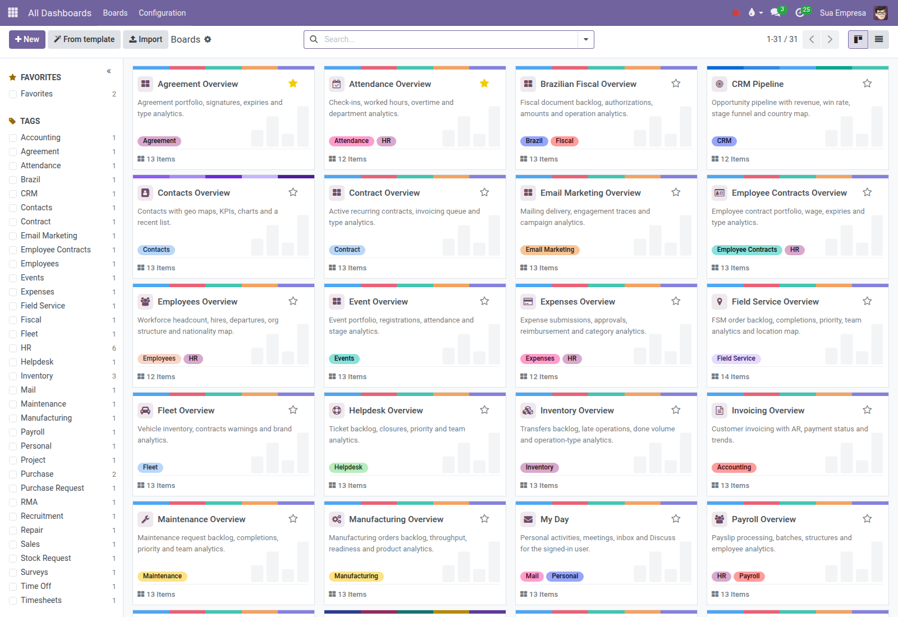
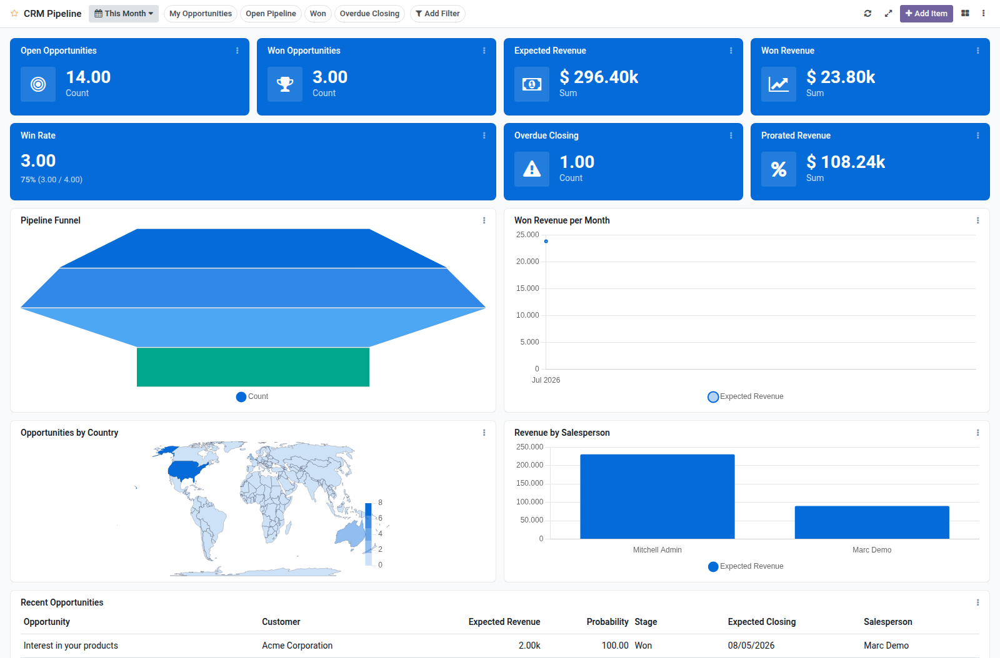
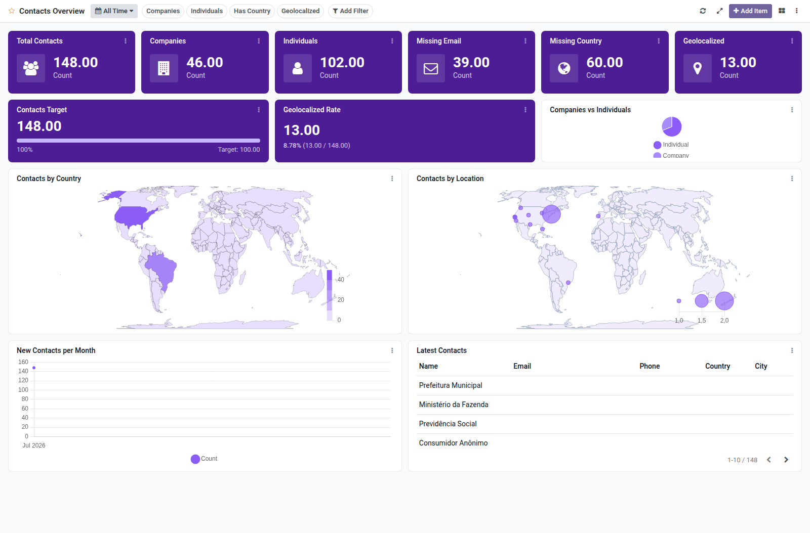
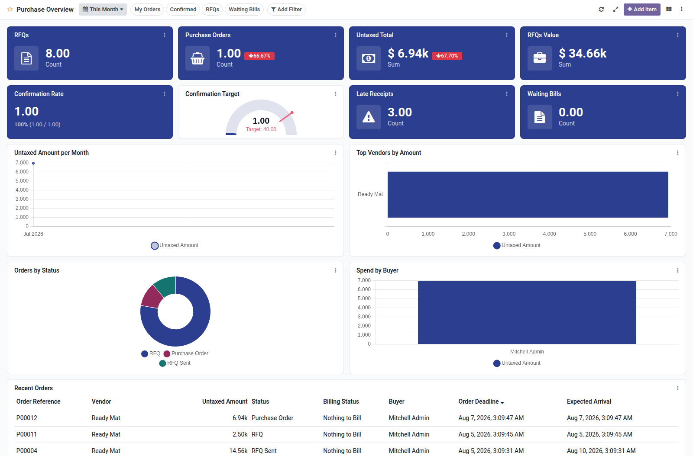
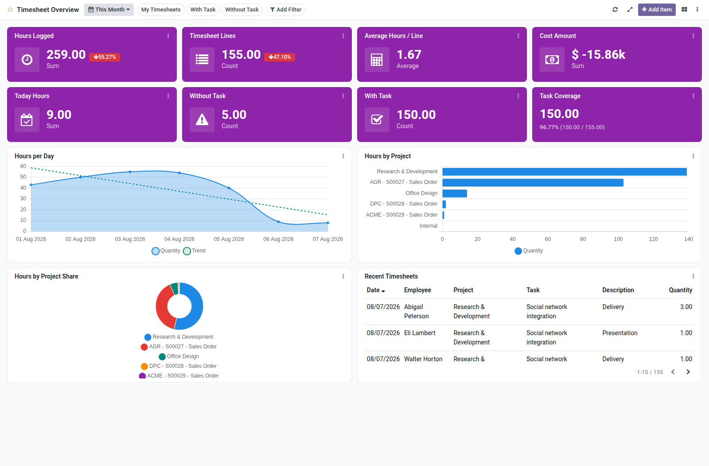

# Boardkit for Odoo
<!-- /!\ Non OCA Context : Set here the badge of your runbot / runboat instance. -->
[](https://github.com/Escodoo/odoo-boardkit/actions/workflows/pre-commit.yml?query=branch%3A16.0)
[](https://github.com/Escodoo/odoo-boardkit/actions/workflows/test.yml?query=branch%3A16.0)
[](https://codecov.io/gh/Escodoo/odoo-boardkit)
[](https://www.gnu.org/licenses/agpl-3.0)
[](https://www.odoo.com/)
<!-- /!\ Non OCA Context : Set here the badge of your translation instance. -->

<!-- /!\ do not modify above this line -->

**Configurable analytic dashboards on top of any Odoo model — without writing code.**

Boardkit is an open source framework for building live boards with tiles, KPIs,
gauges, charts, maps and lists. Managers design the grid in the backend; every
user sees data filtered by their own access rights. Ready-made templates cover
Sales, CRM, Inventory, Accounting, HR, Helpdesk and more.

### Screenshots











### Why Boardkit

| | Proprietary dashboard apps | Boardkit |
| --- | --- | --- |
| License | Closed / paid | **AGPL-3** |
| Data access | Often elevated / shared | **Current user's ACLs & record rules** |
| Stack | Extra JS frameworks | **OWL + a bundled Chart.js 4, loaded on demand** |
| Extension | Vendor roadmaps | **Templates & bridges as separate addons** |
| Wall screens | Rare | **Auto-refresh, fullscreen, server-side cache** |

### Highlights

- **Item types**: tile, KPI, gauge, bar / line / area / pie / doughnut / funnel /
  bullet / radar / scatter, choropleth or point **map**, and paginated **lists**
- **Filters**: date presets and custom ranges, predefined domains, ad-hoc field
  filters, shareable links, personal filter memory
- **Drill down**: multi-level re-aggregation inside a card before opening records
- **Layout**: drag-and-resize grid, personal layouts, publish workflow, optional
  menu / app entry, favorites, JSON export/import, CSV/XLSX per item
- **Templates**: start from curated industry boards; each template can carry
  allowed groups so app users open boards without the Dashboard User right
- **Security first**: item queries always run as the signed-in user
- **Optional AI** (`boardkit_dashboard_ai_agno`): narrative summaries, tile explanations
  and NL board generation via OCA `ai.bridge` + Escodoo Agno

### Requirements

- Odoo **16.0**
- Core module depends on `web`, `web_tour` and `contacts`
- Charts use a vendored Chart.js 4, loaded lazily and isolated from the
  Chart.js 2 that Odoo 16 keeps for its graph views (see
  `boardkit_dashboard/static/lib/README.md`)
- Template addons depend on their respective business apps (and OCA modules where
  noted, e.g. Helpdesk / Field Service)
- AI addon additionally needs `ai_oca_bridge` from
  [Escodoo/ai](https://github.com/Escodoo/ai) `16.0` and the Agno service
  (`/bridge/boardkit/*`)

### Installation

Add this repository to your addons path (or pull it with
[git-aggregator](https://github.com/acsone/git-aggregator) / Doodba), update the
apps list, then install:

1. **`boardkit_dashboard`** — the framework
2. Optional template modules (`boardkit_dashboard_sale`, `boardkit_dashboard_crm`,
   …) for the boards you need

On a Doodba project, declare the modules in `addons.yaml` and rebuild / update as
usual.

### Getting started

1. Install `boardkit_dashboard` (and any template addon).
2. As a Dashboard Manager, open **All Dashboards → Boards** and create a board
   **From template**, or build one from scratch.
3. Review items, filters and allowed groups; **Publish** when ready.
4. Optionally set **Parent Menu**, **Show as App**, or **Auto Refresh** for
   kiosk / TV use (fullscreen from the board toolbar).

Full usage notes live in
[`boardkit_dashboard/readme/USAGE.md`](boardkit_dashboard/readme/USAGE.md).

### Documentation

| Topic | Where |
| --- | --- |
| Framework description | [`boardkit_dashboard/README.rst`](boardkit_dashboard/README.rst) |
| Configuration | [`boardkit_dashboard/readme/CONFIGURE.md`](boardkit_dashboard/readme/CONFIGURE.md) |
| Roadmap | [`boardkit_dashboard/readme/ROADMAP.md`](boardkit_dashboard/readme/ROADMAP.md) |
| Per-app templates | Each `boardkit_dashboard_*/README.rst` |

### Contributing

Issues and pull requests are welcome on
[Escodoo/odoo-boardkit](https://github.com/Escodoo/odoo-boardkit).

- Target the **`16.0`** branch. Fixes shared with Odoo 18 land on `18.0` first
  and are backported here.
- Follow Odoo R&D commit style (`[ADD]`, `[FIX]`, `[IMP]`, …) and keep **one
  addon per commit** when feasible.
- Run `pre-commit run --all-files` before pushing.
- Keep source strings in **English**; translations go through `i18n/`.
- After adding or removing installable addons, regenerate the table below with:

  ```bash
  oca-gen-addons-table
  ```

### Credits

Maintained by [Escodoo](https://www.escodoo.com.br). Primary maintainer:
[@marcelsavegnago](https://github.com/marcelsavegnago).

<!-- /!\ do not modify below this line -->

<!-- prettier-ignore-start -->

[//]: # (addons)

Available addons
----------------
addon | version | maintainers | summary
--- | --- | --- | ---
[boardkit_dashboard](boardkit_dashboard/) | 16.0.1.0.0 | <a href='https://github.com/marcelsavegnago'></a> | Configurable analytic dashboards with tiles, KPIs, charts and lists
[boardkit_dashboard_account](boardkit_dashboard_account/) | 16.0.1.0.0 | <a href='https://github.com/marcelsavegnago'></a> | Invoicing dashboard template for Boardkit
[boardkit_dashboard_agreement](boardkit_dashboard_agreement/) | 16.0.1.0.0 | <a href='https://github.com/marcelsavegnago'></a> | Agreements overview dashboard template for Boardkit
[boardkit_dashboard_ai_agno](boardkit_dashboard_ai_agno/) | 16.0.1.0.0 | <a href='https://github.com/marcelsavegnago'></a> | Board chat, insights, tile explanations and NL generation via Agno
[boardkit_dashboard_contract](boardkit_dashboard_contract/) | 16.0.1.0.0 | <a href='https://github.com/marcelsavegnago'></a> | Recurring contracts overview dashboard template for Boardkit
[boardkit_dashboard_crm](boardkit_dashboard_crm/) | 16.0.1.0.0 | <a href='https://github.com/marcelsavegnago'></a> | CRM pipeline dashboard template for Boardkit
[boardkit_dashboard_event](boardkit_dashboard_event/) | 16.0.1.0.0 | <a href='https://github.com/marcelsavegnago'></a> | Events overview dashboard template for Boardkit
[boardkit_dashboard_fieldservice](boardkit_dashboard_fieldservice/) | 16.0.1.0.0 | <a href='https://github.com/marcelsavegnago'></a> | Field Service overview dashboard template for Boardkit
[boardkit_dashboard_fleet](boardkit_dashboard_fleet/) | 16.0.1.0.0 | <a href='https://github.com/marcelsavegnago'></a> | Fleet overview dashboard template for Boardkit
[boardkit_dashboard_helpdesk_mgmt](boardkit_dashboard_helpdesk_mgmt/) | 16.0.1.0.0 | <a href='https://github.com/marcelsavegnago'></a> | Helpdesk overview dashboard template for Boardkit
[boardkit_dashboard_hr](boardkit_dashboard_hr/) | 16.0.1.0.0 | <a href='https://github.com/marcelsavegnago'></a> | Employees overview dashboard template for Boardkit
[boardkit_dashboard_hr_attendance](boardkit_dashboard_hr_attendance/) | 16.0.1.0.0 | <a href='https://github.com/marcelsavegnago'></a> | Attendance overview dashboard template for Boardkit
[boardkit_dashboard_hr_contract](boardkit_dashboard_hr_contract/) | 16.0.1.0.0 | <a href='https://github.com/marcelsavegnago'></a> | Employee contracts overview dashboard template for Boardkit
[boardkit_dashboard_hr_expense](boardkit_dashboard_hr_expense/) | 16.0.1.0.0 | <a href='https://github.com/marcelsavegnago'></a> | Expenses overview dashboard template for Boardkit
[boardkit_dashboard_hr_holidays](boardkit_dashboard_hr_holidays/) | 16.0.1.0.0 | <a href='https://github.com/marcelsavegnago'></a> | Time Off overview dashboard template for Boardkit
[boardkit_dashboard_hr_recruitment](boardkit_dashboard_hr_recruitment/) | 16.0.1.0.0 | <a href='https://github.com/marcelsavegnago'></a> | Recruitment overview dashboard template for Boardkit
[boardkit_dashboard_hr_timesheet](boardkit_dashboard_hr_timesheet/) | 16.0.1.0.0 | <a href='https://github.com/marcelsavegnago'></a> | Timesheet overview dashboard template for Boardkit
[boardkit_dashboard_l10n_br_fiscal](boardkit_dashboard_l10n_br_fiscal/) | 16.0.1.0.0 | <a href='https://github.com/marcelsavegnago'></a> | Brazilian fiscal documents overview dashboard template for Boardkit
[boardkit_dashboard_mail](boardkit_dashboard_mail/) | 16.0.1.0.0 | <a href='https://github.com/marcelsavegnago'></a> | Personal My Day dashboard template for Boardkit
[boardkit_dashboard_maintenance](boardkit_dashboard_maintenance/) | 16.0.1.0.0 | <a href='https://github.com/marcelsavegnago'></a> | Maintenance overview dashboard template for Boardkit
[boardkit_dashboard_mass_mailing](boardkit_dashboard_mass_mailing/) | 16.0.1.0.0 | <a href='https://github.com/marcelsavegnago'></a> | Email marketing overview dashboard template for Boardkit
[boardkit_dashboard_mrp](boardkit_dashboard_mrp/) | 16.0.1.0.0 | <a href='https://github.com/marcelsavegnago'></a> | Manufacturing overview dashboard template for Boardkit
[boardkit_dashboard_payroll](boardkit_dashboard_payroll/) | 16.0.1.0.0 | <a href='https://github.com/marcelsavegnago'></a> | Payroll overview dashboard template for Boardkit
[boardkit_dashboard_project](boardkit_dashboard_project/) | 16.0.1.0.0 | <a href='https://github.com/marcelsavegnago'></a> | Project tasks overview dashboard template for Boardkit
[boardkit_dashboard_purchase](boardkit_dashboard_purchase/) | 16.0.1.0.0 | <a href='https://github.com/marcelsavegnago'></a> | Purchase overview dashboard template for Boardkit
[boardkit_dashboard_purchase_request](boardkit_dashboard_purchase_request/) | 16.0.1.0.0 | <a href='https://github.com/marcelsavegnago'></a> | Purchase request overview dashboard template for Boardkit
[boardkit_dashboard_repair](boardkit_dashboard_repair/) | 16.0.1.0.0 | <a href='https://github.com/marcelsavegnago'></a> | Repair overview dashboard template for Boardkit
[boardkit_dashboard_rma](boardkit_dashboard_rma/) | 16.0.1.0.0 | <a href='https://github.com/marcelsavegnago'></a> | RMA overview dashboard template for Boardkit
[boardkit_dashboard_sale](boardkit_dashboard_sale/) | 16.0.1.0.0 | <a href='https://github.com/marcelsavegnago'></a> | Sales overview dashboard template for Boardkit
[boardkit_dashboard_stock](boardkit_dashboard_stock/) | 16.0.1.0.0 | <a href='https://github.com/marcelsavegnago'></a> | Inventory overview dashboard template for Boardkit
[boardkit_dashboard_stock_request](boardkit_dashboard_stock_request/) | 16.0.1.0.0 | <a href='https://github.com/marcelsavegnago'></a> | Stock request overview dashboard template for Boardkit
[boardkit_dashboard_survey](boardkit_dashboard_survey/) | 16.0.1.0.0 | <a href='https://github.com/marcelsavegnago'></a> | Surveys overview dashboard template for Boardkit

[//]: # (end addons)

<!-- prettier-ignore-end -->

## Licenses

This repository is licensed under [AGPL-3.0](LICENSE).

However, each module can have a totally different license, as long as they adhere to Escodoo
policy. Consult each module's `__manifest__.py` file, which contains a `license` key
that explains its license.

----
<!-- /!\ Non OCA Context : Set here the full description of your organization. -->

**[Escodoo](https://www.escodoo.com.br)** builds and maintains open source addons
for the Odoo community — including this Boardkit framework — and helps
organizations design, implement and run Odoo in production.
