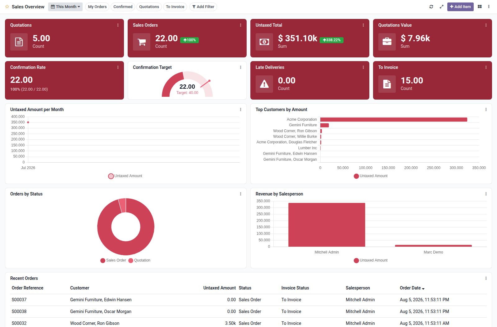

Build configurable analytic dashboards on top of any Odoo model, without writing code.

Each dashboard is a grid of items rendered with OWL and Chart.js 4. Odoo 16 only ships
Chart.js 2, so the module bundles Chart.js 4 and loads it on demand, without touching
the Chart.js used by the standard graph views:

- **Tile**: a single aggregated value (count, sum or average) with icon and colors.
- **KPI**: a value compared against a fixed target or against a second data source (sum,
  ratio or percentage), optionally compared with the previous period.
- **Gauge**: a semicircular gauge for a single aggregated value, with optional target
  and configurable maximum.
- **Charts**: bar, horizontal bar, line, area, pie, doughnut, polar area, radar,
  scatter, funnel and bullet, with group by (including date granularity), optional
  second dimension, multiple measures, record limit, sorting, and optional target,
  average and linear trend line overlays on cartesian charts.
- **Multi-level drill down**: configure extra grouping levels per item so each click
  re-aggregates inside the card (with breadcrumbs) before opening the records.
- **Map**: choropleth of values grouped by country (`res.country`), or point markers
  from configurable latitude / longitude fields on any model (partners, tickets, field
  service orders, ...). An optional focus country crops the outline and zooms the map.
  The built-in **Contacts Overview** template includes both a country map and a points
  map on `partner_latitude` / `partner_longitude`.
- **List**: plain or grouped record lists with pagination and click-through to the
  records.

Dashboard level features:

- Date range filter with presets (today, this month, quarter to date, last 30 days, ...)
  or a custom range, applied to every item through its configured date field.
- Predefined domain filters that users can toggle from the dashboard.
- Ad-hoc filters: any user can pick a field, an operator and a value to filter the
  items on the fly, without configuration.
- Per-item data export as CSV or XLSX, honoring the active filters.
- Drag and resize grid layout: managers save the default layout, every user can keep a
  personal layout.
- Publish/unpublish workflow so managers can build boards privately before users see
  them; optional menu entry under any top-level menu, restricted by groups.
- Auto refresh interval with a per-user server-side data cache for wall screens,
  dashboard duplication and JSON export/import.
- Live preview in the item form while configuring, before saving.
- Responsive one-column layout on mobile viewports.

Data is always read with the access rights of the current user: ACLs and record rules of
the source models are enforced.
