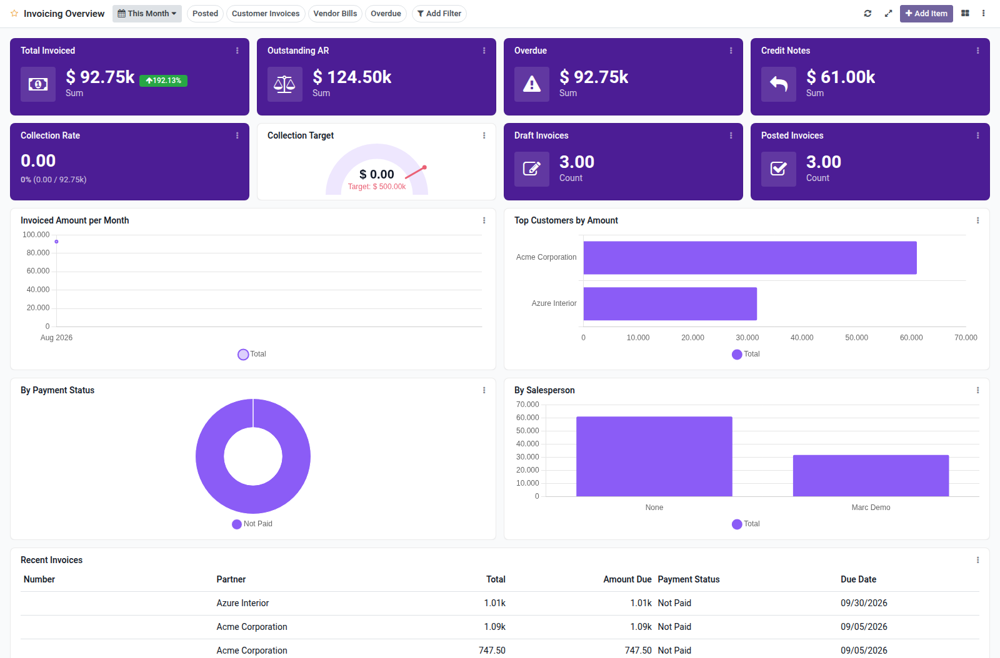

Invoicing dashboard template for Boardkit.

Adds a curated **Invoicing Overview** template that managers can instantiate from
_From template_ in the Boards catalogue. The board is built on `account.move`
and lands unpublished so it can be reviewed before users see it.

It focuses on customer invoicing and receivables: billed amount (with period
comparison), outstanding and overdue AR, credit notes, collection rate, amount
trends, payment status, top customers, salesperson breakdown and a recent
invoices list. Toggle filters cover posted moves, customer invoices, vendor
bills and overdue residuals.

