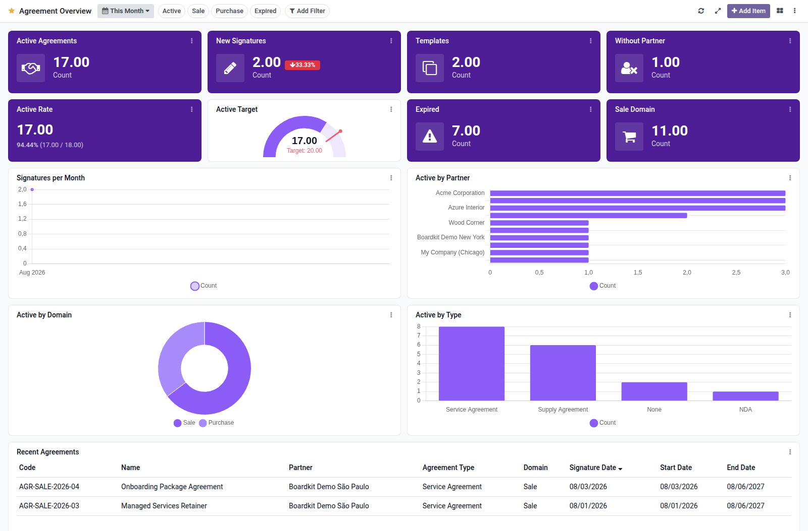

Agreements overview dashboard template for Boardkit.

Adds a curated **Agreement Overview** template that managers can instantiate
from _From template_ in the Boards catalogue. The board is built on `agreement`
from the [OCA Agreement](https://github.com/OCA/agreement) project and lands
unpublished so it can be reviewed before users see it.

It focuses on agreement portfolio health: active deals and templates, new
signatures (with period comparison), active rate, agreements past their end date, sale-domain
counts, signature trends, partner concentration, domain and type breakdowns,
and a recent agreements list. Toggle filters cover active, sale, purchase and
expired agreements.

