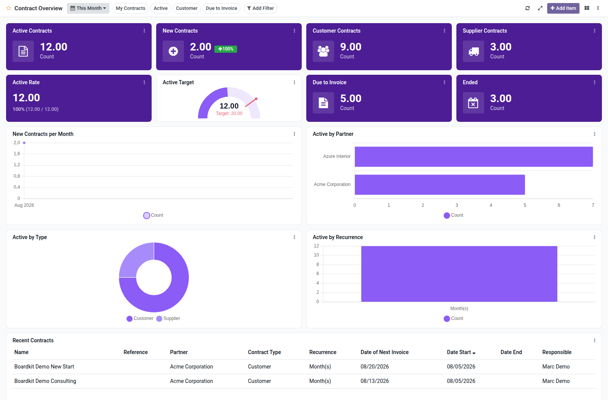

Recurring contracts overview dashboard template for Boardkit.

Adds a curated **Contract Overview** template that managers can instantiate from
_From template_ in the Boards catalogue. The board is built on
`contract.contract` from the [OCA Contract](https://github.com/OCA/contract)
project and lands unpublished so it can be reviewed before users see it.

It focuses on portfolio health: active customer and supplier contracts, new
starts (with period comparison), active rate, due-to-invoice backlog, ended
contracts, start trends, partner concentration, type and recurrence
breakdowns, and a recent contracts list. Toggle filters cover my contracts,
active, customer and due-to-invoice queues.

