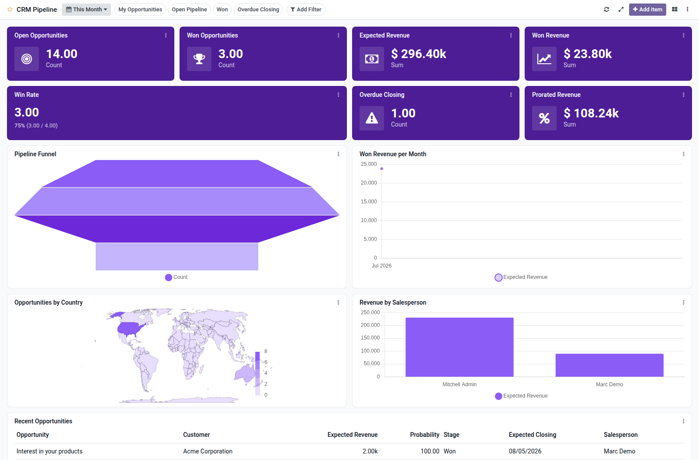

CRM pipeline dashboard template for Boardkit.

Adds a curated **CRM Pipeline** template that managers can instantiate from
_From template_ in the Boards catalogue. The board is built on `crm.lead`
(opportunities) and lands unpublished so it can be reviewed before users see it.

It focuses on pipeline health and conversion: open and won counts, expected and
won revenue, prorated revenue, win rate, overdue expected closings, a stage
funnel, source and salesperson revenue breakdowns, and a recent opportunities
list. Toggle filters cover my opportunities, open pipeline, won deals and
overdue closings.

