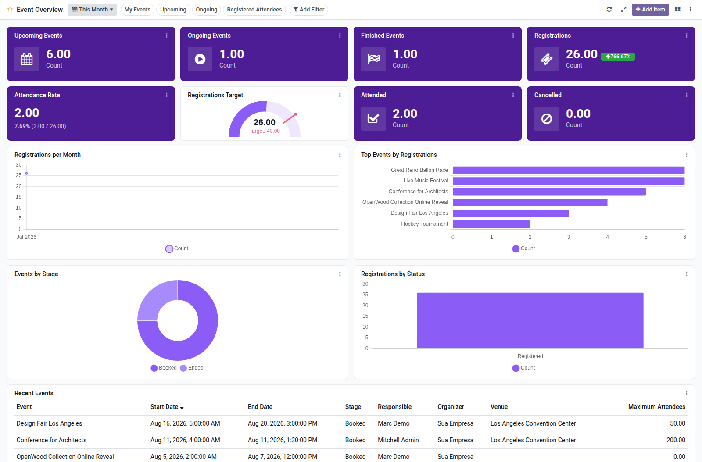

Events overview dashboard template for Boardkit.

Adds a curated **Event Overview** template that managers can instantiate from
_From template_ in the Boards catalogue. The board is built on `event.event` and
`event.registration` and lands unpublished so it can be reviewed before users
see it.

It focuses on portfolio and attendance health: upcoming and ongoing events,
finished events and registrations (with period comparison), attendance rate,
attended and cancelled attendees, registration trends, top events, stage and
registration status breakdowns, and a recent events list. Toggle filters cover
my events, upcoming, ongoing and registered attendees.

