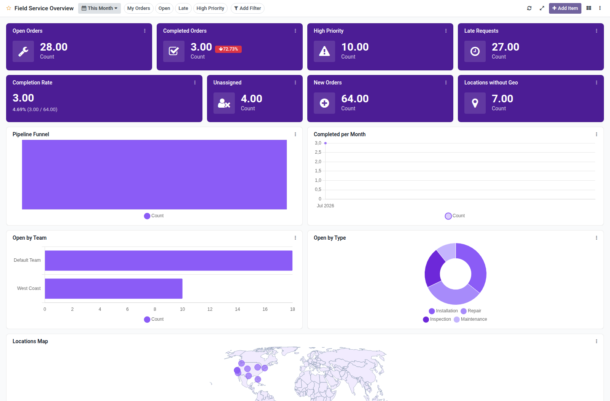

Field Service overview dashboard template for Boardkit.

Adds a curated **Field Service Overview** template that managers can instantiate
from _From template_ in the Boards catalogue. The board is built on `fsm.order`
from the [OCA Field Service](https://github.com/OCA/field-service) project and
lands unpublished so it can be reviewed before users see it.

It focuses on order delivery: open and completed counts, high-priority and late
backlogs, completion rate, unassigned orders, trends, team and stage analytics,
and a recent orders list. Toggle filters cover my orders, open, late and high
priority.

