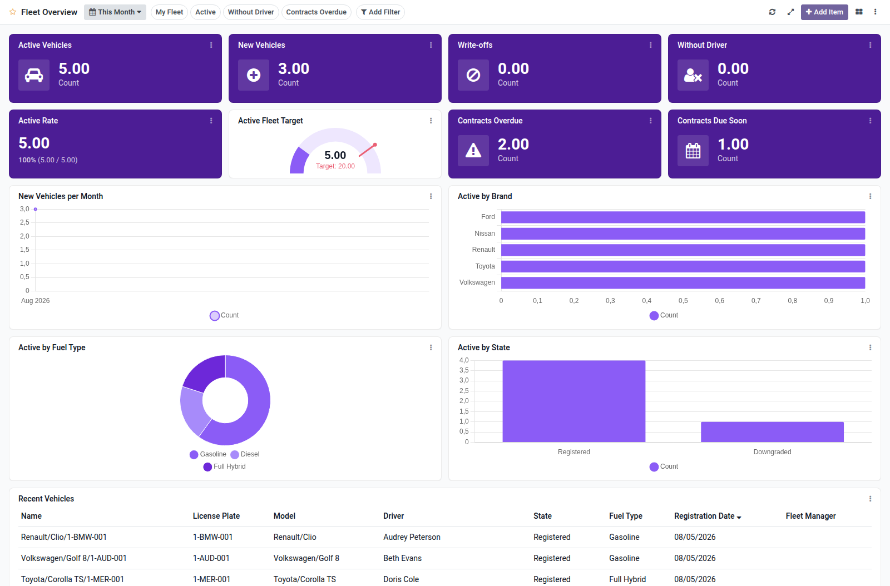

Fleet overview dashboard template for Boardkit.

Adds a curated **Fleet Overview** template that managers can instantiate from
_From template_ in the Boards catalogue. The board is built on `fleet.vehicle`
and lands unpublished so it can be reviewed before users see it.

It focuses on fleet health: active vehicles, new registrations and write-offs,
active rate, vehicles without driver, contract renewal warnings, trends, brand
and fuel analytics, and a recent vehicles list. Toggle filters cover my fleet,
active vehicles, without driver and overdue contracts.

