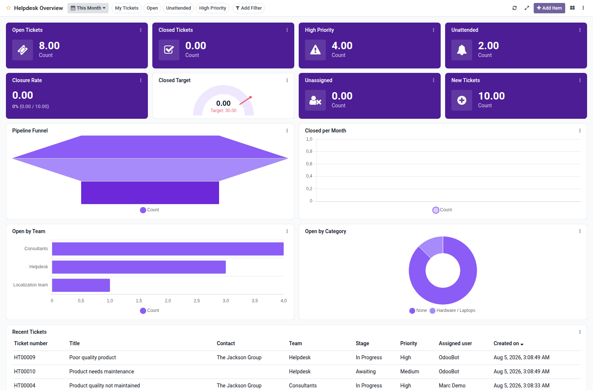

Helpdesk overview dashboard template for Boardkit.

Adds a curated **Helpdesk Overview** template that managers can instantiate from
_From template_ in the Boards catalogue. The board is built on `helpdesk.ticket`
from the [OCA Helpdesk](https://github.com/OCA/helpdesk) project and lands
unpublished so it can be reviewed before users see it.

It focuses on ticket delivery: open and closed counts, high-priority and
unattended backlogs, closure rate, unassigned tickets, trends, team and stage
analytics, and a recent tickets list. Toggle filters cover my tickets, open,
unattended and high priority.

