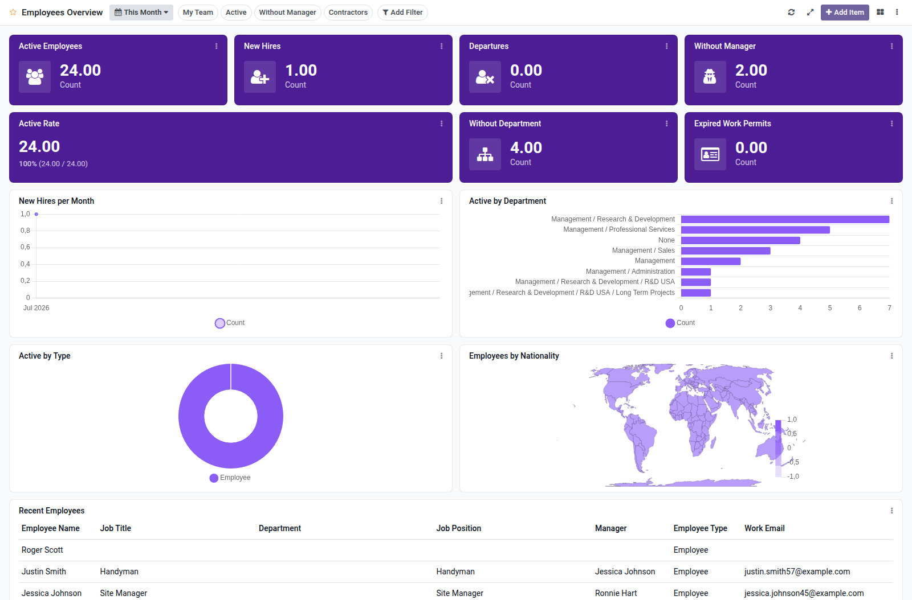

Employees overview dashboard template for Boardkit.

Adds a curated **Employees Overview** template that managers can instantiate from
_From template_ in the Boards catalogue. The board is built on `hr.employee`
and lands unpublished so it can be reviewed before users see it.

It focuses on headcount: active employees, new hires and departures, active
rate, employees without manager or department, expired work permits, hire
trends, department and type breakdowns, and a recent employees list. Toggle
filters cover my team, active employees, without manager and contractors.

