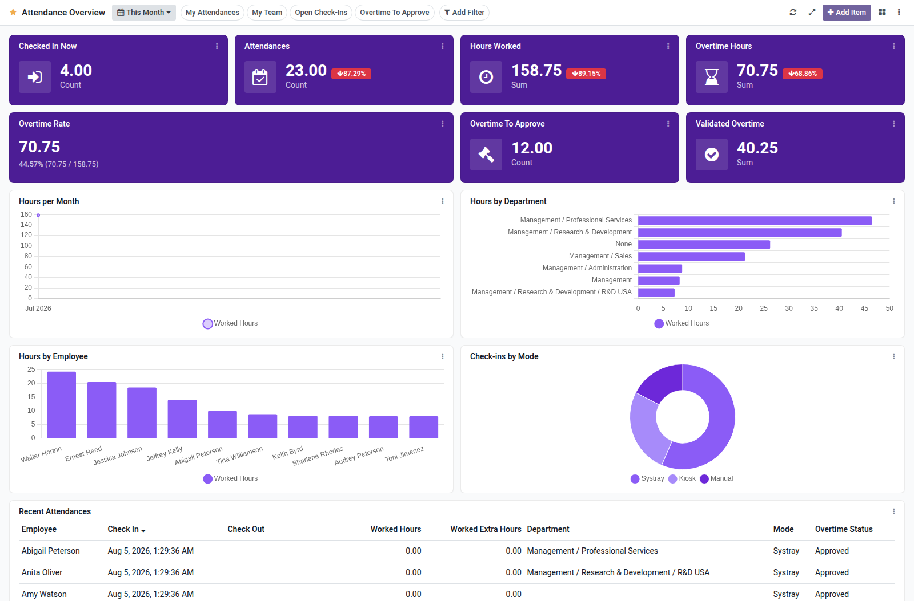

Attendance overview dashboard template for Boardkit.

Adds a curated **Attendance Overview** template that managers can instantiate
from _From template_ in the Boards catalogue. The board is built on
`hr.attendance` and `hr.attendance.overtime`, and lands unpublished so it can be
reviewed before users see it.

It focuses on check-in/out health: currently checked-in employees, attendance
counts, worked and overtime hours, missing hours, overtime adjustments, daily
and weekly trends, employee breakdowns, overtime by employee, and a recent
attendances list. Toggle filters cover my attendances, my team, open check-ins
and long shifts.

