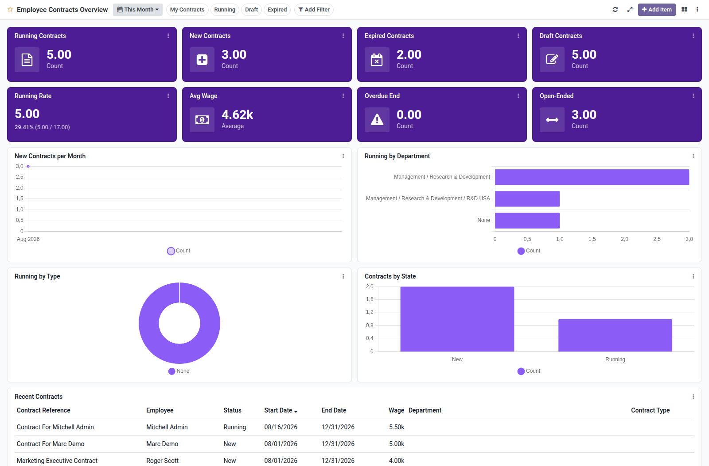

Employee contracts overview dashboard template for Boardkit.

Adds a curated **Employee Contracts Overview** template that managers can
instantiate from _From template_ in the Boards catalogue. The board is built on
`hr.contract` and lands unpublished so it can be reviewed before users see it.

It focuses on employee contract lifecycle: running and draft counts, new and
expired contracts, average wage, overdue endings, start trends, department and
type breakdowns, and a recent contracts list. Toggle filters cover my contracts,
running, draft and expired.

