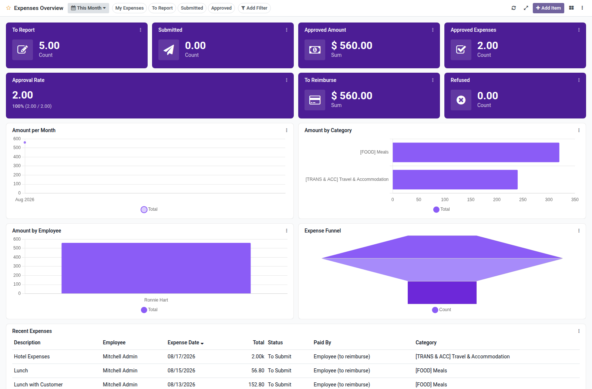

Expenses overview dashboard template for Boardkit.

Adds a curated **Expenses Overview** template that managers can instantiate from
_From template_ in the Boards catalogue. The board is built on `hr.expense` and
lands unpublished so it can be reviewed before users see it.

It focuses on expense health: to-report and submitted backlogs, approved totals
and counts, approval rate, reimbursement queue, amount trends, employee and
category breakdowns, and a recent expenses list. Toggle filters cover my
expenses, to report, submitted and approved.

