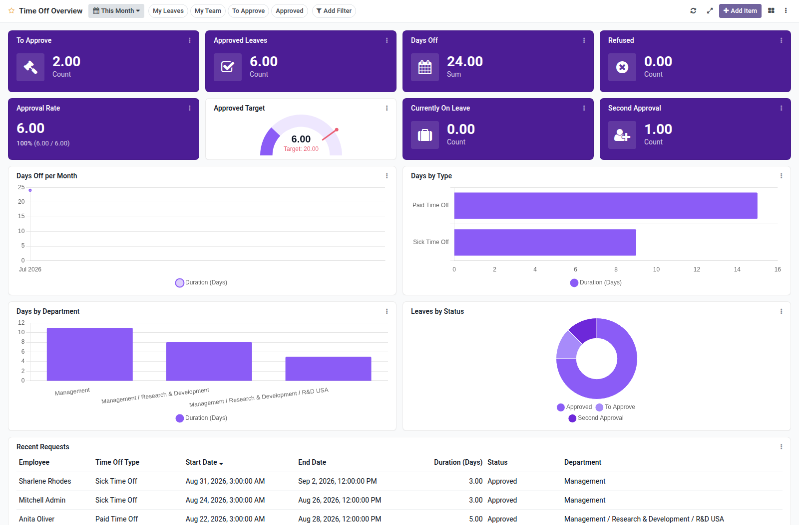

Time Off overview dashboard template for Boardkit.

Adds a curated **Time Off Overview** template that managers can instantiate from
_From template_ in the Boards catalogue. The board is built on `hr.leave` and
lands unpublished so it can be reviewed before users see it.

It focuses on leave request health: to-approve and second-approval backlogs,
approved and refused counts, days off totals, approval rate, employees currently
on leave, monthly trends, leave type and department breakdowns, and a recent
requests list. Toggle filters cover my leaves, my team, to approve and approved.

