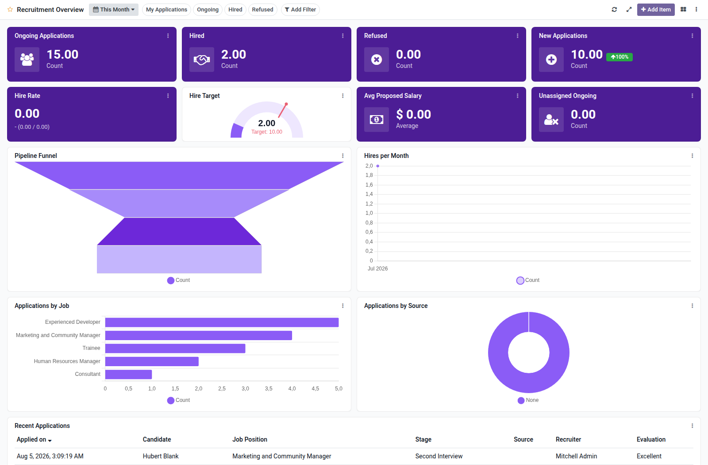

Recruitment overview dashboard template for Boardkit.

Adds a curated **Recruitment Overview** template that managers can instantiate
from _From template_ in the Boards catalogue. The board is built on
`hr.applicant` and lands unpublished so it can be reviewed before users see it.

It focuses on the hiring pipeline: ongoing applications, hires and refusals,
hire rate, stage and job breakdowns, source analytics, and a recent applicants
list. Toggle filters cover my applications, ongoing, hired and refused.

