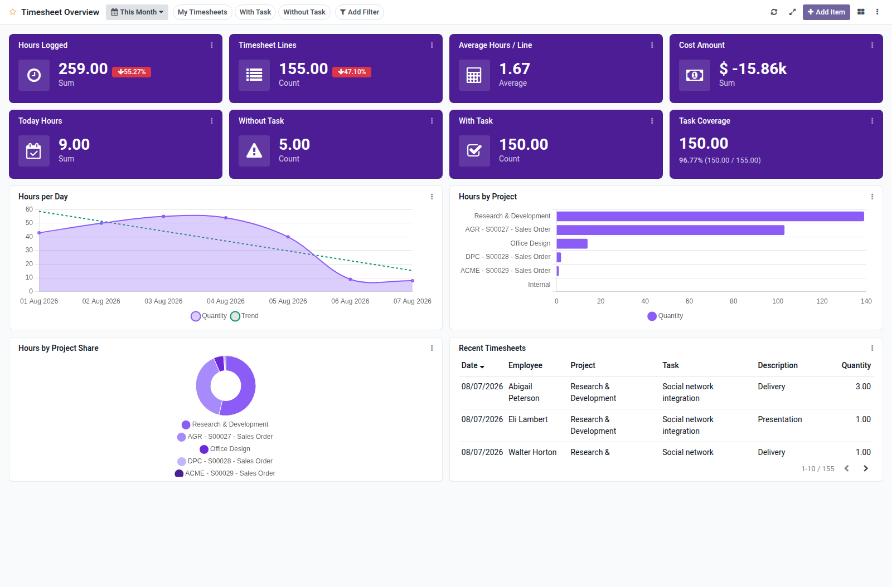

Timesheet overview dashboard template for Boardkit.

Adds a curated **Timesheet Overview** template that managers can instantiate from
_From template_ in the Boards catalogue. The board is built on
`account.analytic.line` (timesheet lines with a project) and lands unpublished so
it can be reviewed before users see it.

It focuses on time spent across projects: hours logged (with period comparison),
line counts, average hours, today backlog, missing-task lines, cost amount, daily
trends, project/employee/department breakdowns, and a recent timesheets list.
Toggle filters cover my timesheets, lines with a task, and lines without a task.

