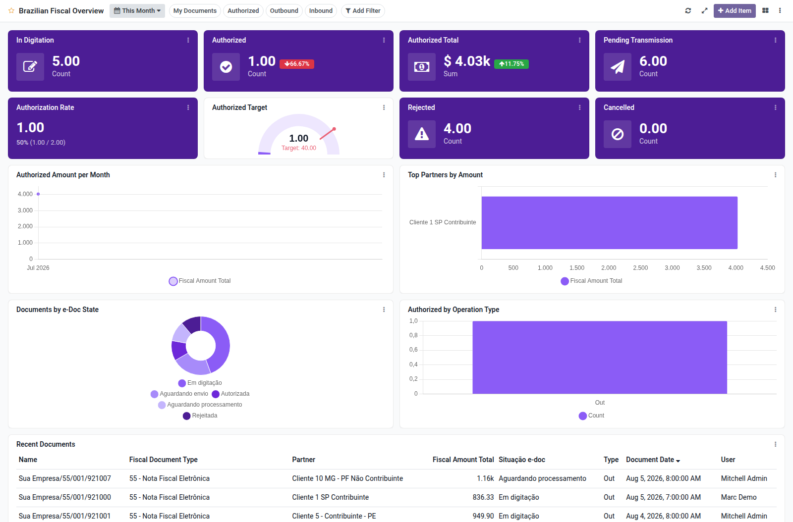

Brazilian fiscal documents overview dashboard template for Boardkit.

Adds a curated **Brazilian Fiscal Overview** template that managers can
instantiate from _From template_ in the Boards catalogue. The board is built on
`l10n_br_fiscal.document` from the
[OCA l10n-brazil](https://github.com/OCA/l10n-brazil) project and lands
unpublished so it can be reviewed before users see it. On Odoo 16 it depends on
`l10n_br_fiscal_edi`, which adds the transmission and authorization e-doc
states the board counts.

It focuses on electronic document health: documents in digitation, pending
transmission, authorized counts and fiscal totals (with period comparison),
authorization rate, rejected and cancelled documents, amount trends, top
partners, e-Doc state and operation type breakdowns, and a recent documents
list. Toggle filters cover my documents, authorized, outbound and inbound
operations.

