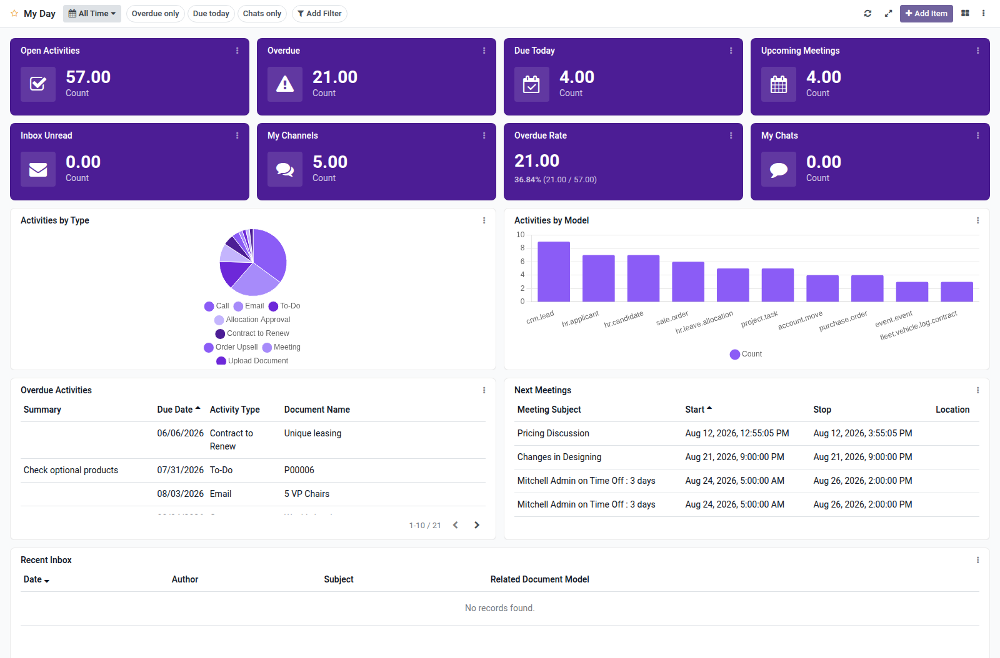

Personal My Day dashboard template for Boardkit.

Adds a curated **My Day** template that managers can instantiate from
_From template_ in the Boards catalogue. The board is scoped to the signed-in
user: open and overdue activities, today's due items, upcoming meetings, inbox
unread counts, Discuss channels and chats, plus lists for overdue activities,
next meetings and recent inbox messages. It lands unpublished so it can be
reviewed before users see it.

Requires Discuss / Mail and Calendar. Allowed Groups defaults to Internal User
so any employee can open a board created from this template.

