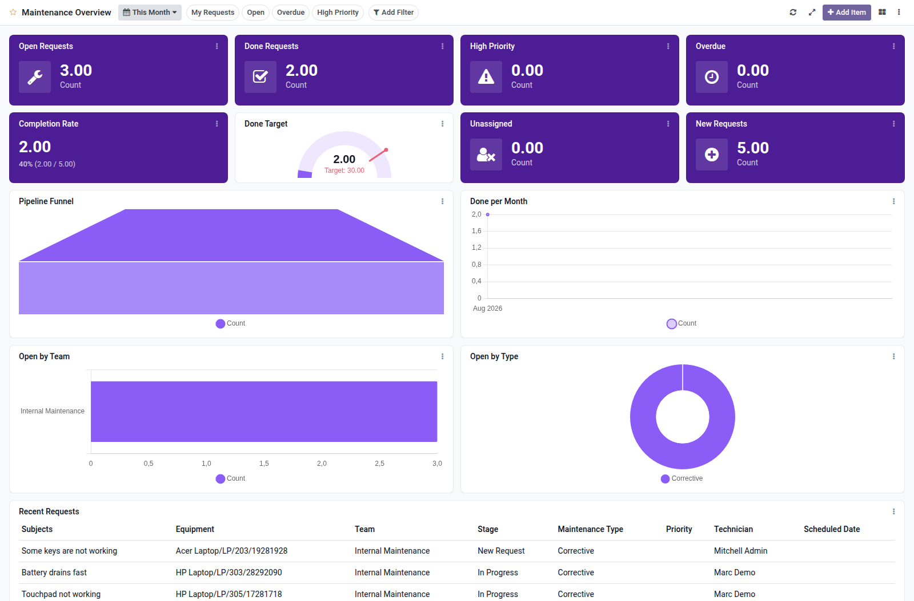

Maintenance overview dashboard template for Boardkit.

Adds a curated **Maintenance Overview** template that managers can instantiate
from _From template_ in the Boards catalogue. The board is built on
`maintenance.request` and lands unpublished so it can be reviewed before users
see it.

It focuses on request delivery: open and done counts, high-priority and overdue
backlogs, completion rate, unassigned requests, trends, team and type analytics,
and a recent requests list. Toggle filters cover my requests, open, overdue and
high priority.

