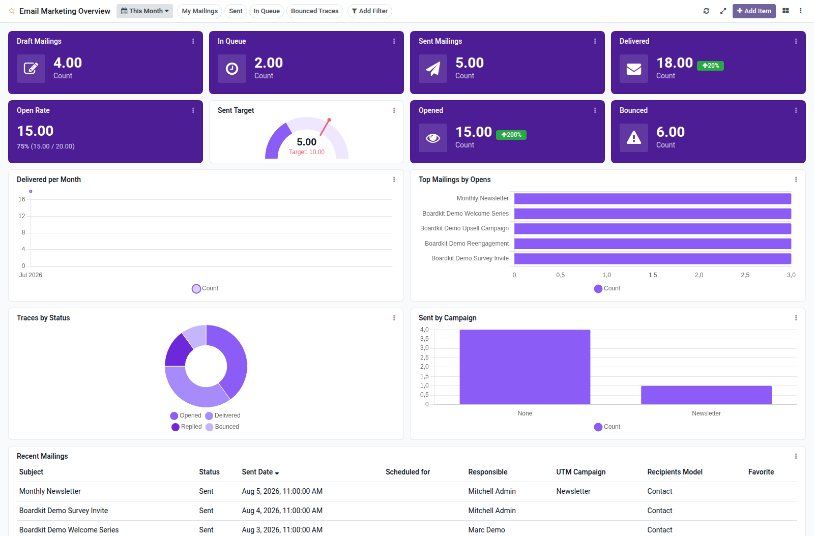

Email marketing overview dashboard template for Boardkit.

Adds a curated **Email Marketing Overview** template that managers can
instantiate from _From template_ in the Boards catalogue. The board is built on
`mailing.mailing` and `mailing.trace` and lands unpublished so it can be
reviewed before users see it.

It focuses on delivery and engagement: drafts and queue, sent campaigns,
delivered and opened traces (with period comparison), open rate, bounced
traces, delivery trends, top mailings by opens, trace status and campaign
breakdowns, and a recent mailings list. Toggle filters cover my mailings, sent,
in queue and bounced traces.

