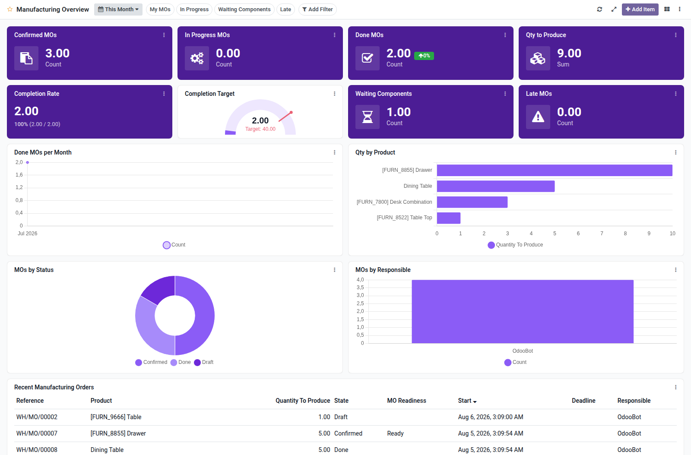

Manufacturing overview dashboard template for Boardkit.

Adds a curated **Manufacturing Overview** template that managers can instantiate
from _From template_ in the Boards catalogue. The board is built on
`mrp.production` and lands unpublished so it can be reviewed before users see it.

It focuses on shop-floor health: confirmed and in-progress MOs, done volume
(with period comparison), open backlog, completion rate, waiting
components, late MOs, throughput trends, product and status breakdowns, and a
recent manufacturing orders list. Toggle filters cover my MOs, in progress,
waiting components and late orders.

