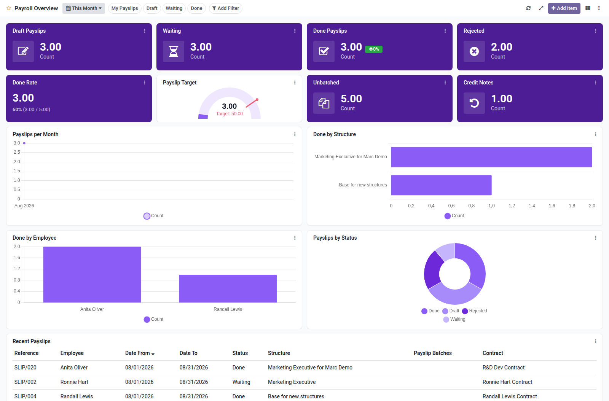

Payroll overview dashboard template for Boardkit.

Adds a curated **Payroll Overview** template that managers can instantiate from
_From template_ in the Boards catalogue. The board is built on `hr.payslip` from
the [OCA Payroll](https://github.com/OCA/payroll) project and lands unpublished
so it can be reviewed before users see it.

It focuses on payslip processing: draft and waiting backlogs, done and rejected
counts, confirmation rate, unbatched slips, credit notes, monthly trends,
structure and employee breakdowns, and a recent payslips list. Toggle filters
cover my payslips, draft, waiting and done.

