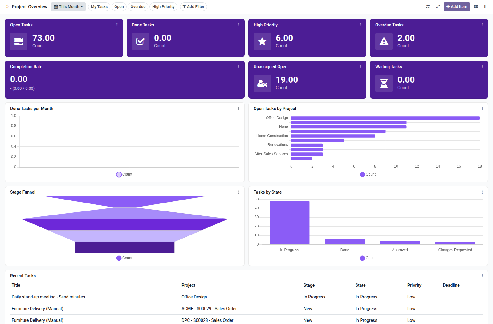

Project tasks overview dashboard template for Boardkit.

Adds a curated **Project Overview** template that managers can instantiate from
_From template_ in the Boards catalogue. The board is built on `project.task`
and lands unpublished so it can be reviewed before users see it.

It focuses on task delivery: open and done counts, high-priority and overdue
backlogs, completion rate, unassigned and waiting tasks, done trends, project
and stage breakdowns, and a recent tasks list. Toggle filters cover my tasks,
open tasks, overdue tasks and high priority.

