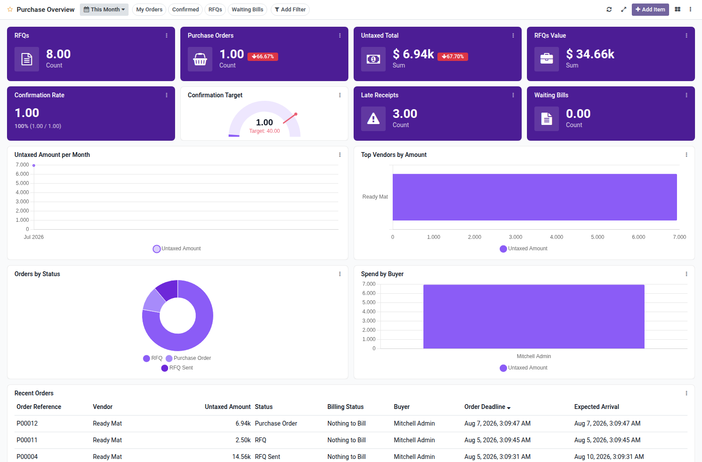

Purchase overview dashboard template for Boardkit.

Adds a curated **Purchase Overview** template that managers can instantiate from
_From template_ in the Boards catalogue. The board is built on `purchase.order`
and lands unpublished so it can be reviewed before users see it.

It focuses on RFQ and order health: open RFQs and their value, confirmed
purchase orders and untaxed totals (with period comparison), confirmation rate,
late receipts, waiting bills, amount trends, top vendors, status and buyer
breakdowns, and a recent orders list. Toggle filters cover my orders, confirmed
orders, RFQs and waiting bills.

