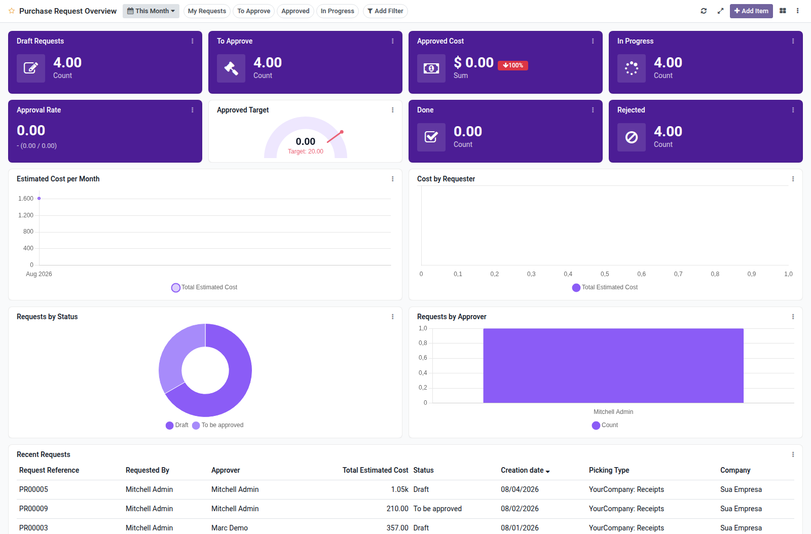

Purchase request overview dashboard template for Boardkit.

Adds a curated **Purchase Request Overview** template that managers can
instantiate from _From template_ in the Boards catalogue. The board is built on
`purchase.request` from the
[OCA Purchase Workflow](https://github.com/OCA/purchase-workflow) project and
lands unpublished so it can be reviewed before users see it.

It focuses on internal demand health: drafts and approval queues, estimated
approved cost (with period comparison), approval rate, in-progress and done
counts, cost trends, requester and approver analytics, status breakdowns, and a
recent requests list. Toggle filters cover my requests, to approve, approved and
in progress.

