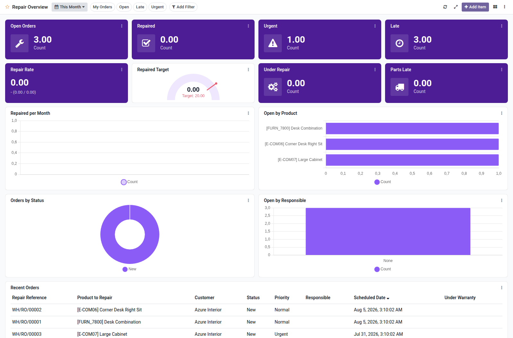

Repair overview dashboard template for Boardkit.

Adds a curated **Repair Overview** template that managers can instantiate from
_From template_ in the Boards catalogue. The board is built on `repair.order`
and lands unpublished so it can be reviewed before users see it.

It focuses on repair order delivery: open and repaired counts, urgent and late
backlogs, completion rate, under-repair and parts-late queues, trends, product
and status analytics, and a recent orders list. Toggle filters cover my orders,
open, late and urgent.

