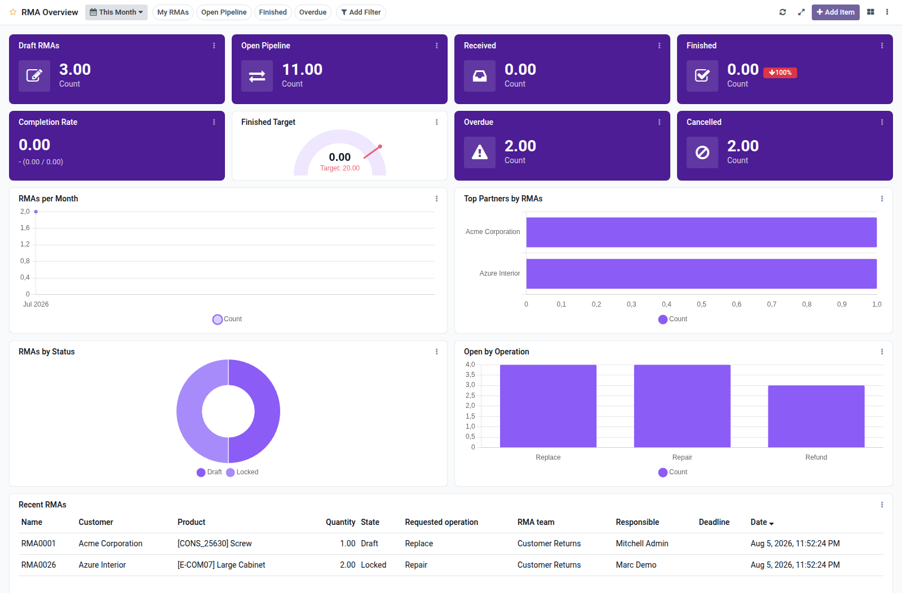

RMA overview dashboard template for Boardkit.

Adds a curated **RMA Overview** template that managers can instantiate from
_From template_ in the Boards catalogue. The board is built on `rma` from the
[OCA RMA](https://github.com/OCA/rma) project and lands unpublished so it can be
reviewed before users see it.

It focuses on return merchandise health: drafts and open pipeline, received and
finished counts (with period comparison), completion rate, overdue deadlines,
cancelled RMAs, volume trends, top partners, status and operation breakdowns,
and a recent RMA list. Toggle filters cover my RMAs, open pipeline, finished and
overdue.

