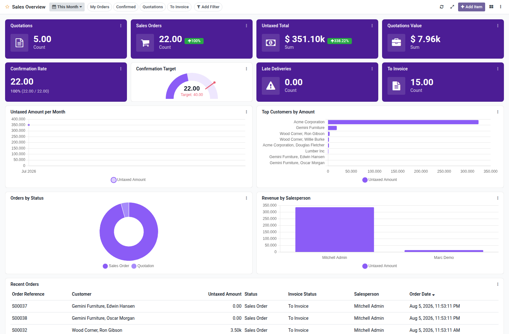

Sales overview dashboard template for Boardkit.

Adds a curated **Sales Overview** template that managers can instantiate from
_From template_ in the Boards catalogue. The board is built on `sale.order` and
lands unpublished so it can be reviewed before users see it.

It focuses on quotation and order health: open quotations and their value,
confirmed orders and untaxed totals (with period comparison), confirmation
rate, late deliveries, to-invoice backlog, amount trends, top customers,
status and salesperson breakdowns, and a recent orders list. Toggle filters
cover my orders, confirmed orders, quotations and to-invoice backlog.

