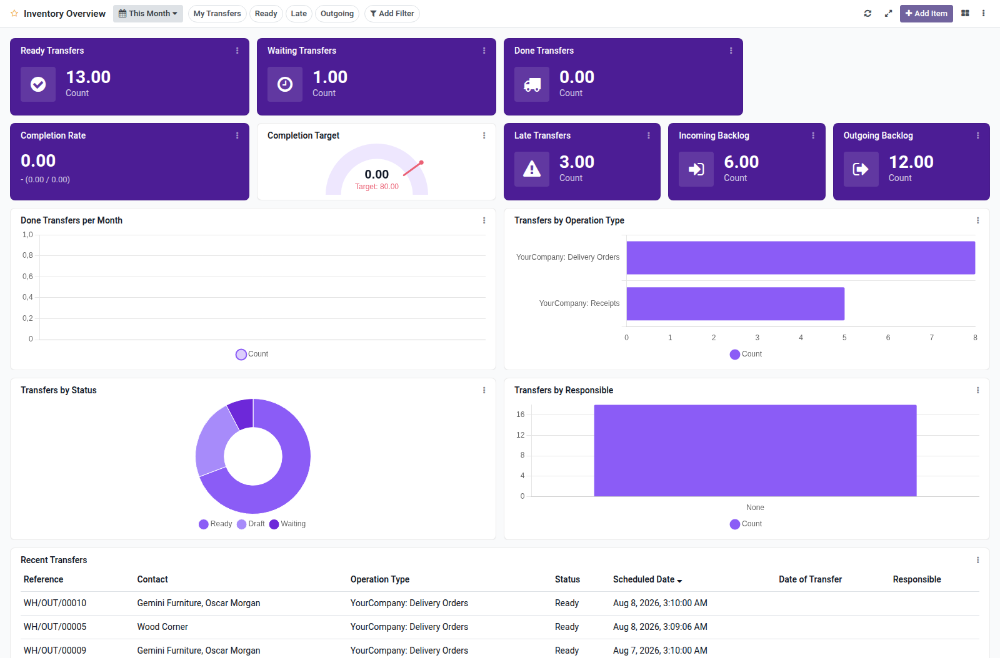

Inventory overview dashboard template for Boardkit.

Adds a curated **Inventory Overview** template that managers can instantiate from
_From template_ in the Boards catalogue. The board is built on `stock.picking`
and lands unpublished so it can be reviewed before users see it.

It focuses on warehouse operations: ready and waiting transfers, done volume
(with period comparison), late transfers, completion rate, incoming and outgoing
backlogs, transfer trends, operation type and status breakdowns, and a recent
transfers list. Toggle filters cover my transfers, ready, late and outgoing.

