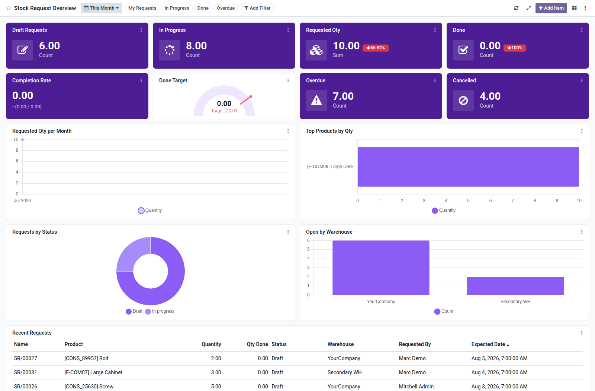

Stock request overview dashboard template for Boardkit.

Adds a curated **Stock Request Overview** template that managers can instantiate
from _From template_ in the Boards catalogue. The board is built on
`stock.request` from the
[OCA Stock Logistics Request](https://github.com/OCA/stock-logistics-request)
project and lands unpublished so it can be reviewed before users see it.

It focuses on internal replenishment health: drafts and open queues, confirmed
requests (with period comparison), completion rate, overdue expected dates,
request trends, top products by quantity, status and warehouse breakdowns, and a
recent requests list. Toggle filters cover my requests, in progress, done and
overdue.

