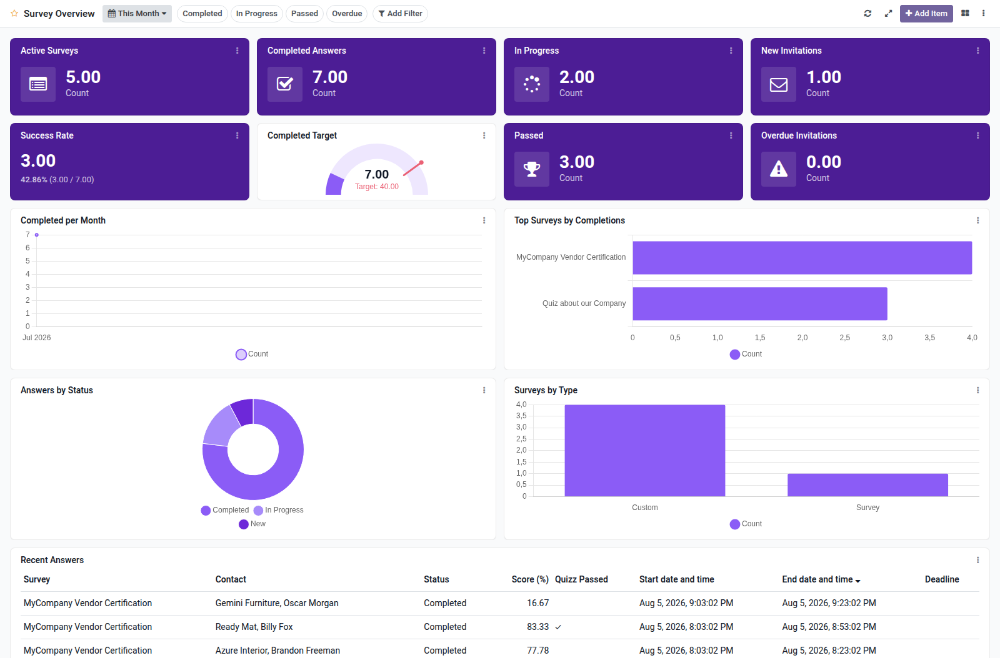

Surveys overview dashboard template for Boardkit.

Adds a curated **Survey Overview** template that managers can instantiate from
_From template_ in the Boards catalogue. The board is built on `survey.survey`
and `survey.user_input` and lands unpublished so it can be reviewed before users
see it.

It focuses on response delivery: active surveys, completed and in-progress
answers (with period comparison), success rate, passed quizzes, overdue
invitations, completion trends, top surveys, answer status and scoring type
breakdowns, and a recent answers list. Toggle filters cover completed, in
progress, passed and overdue answers. Test entries are excluded from metrics.

